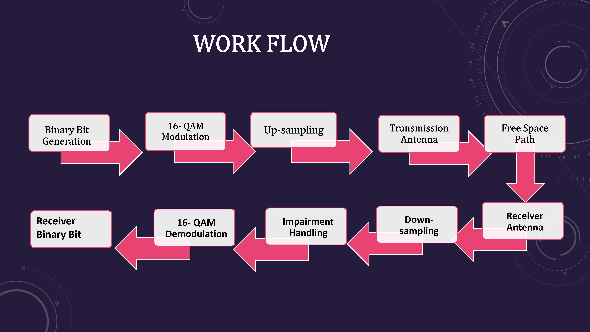
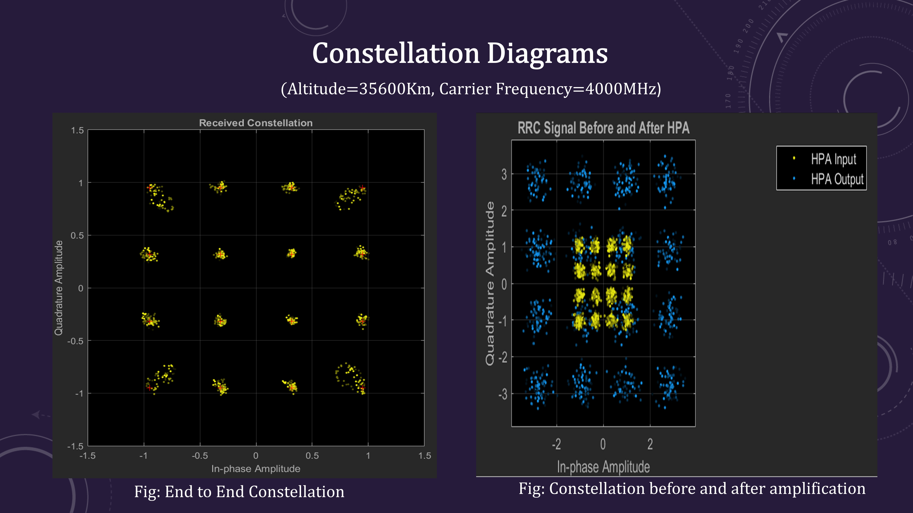

# Modeling-Performance-Analysis-of-RF-Satellite-Downlink

This project shows a model of a satellite link, using the blocks from the Communication Toolbox in Simulink. It models some impairments of the communication link and then optionally corrects the impairments imposed.

The model consists of a Satellite Downlink Transmitter, Downlink Path, and Ground Station Downlink Receiver. The performance of the satellite system using 16 QAM digital modulation technique is analyzed and investigated  which is a spectrally more efficient digital modulation scheme.

We analyzed performance of the satellite link by observing Bit Error rate. We varied antenna diameter, carrier frequency and altitude of the satellite to see the variations in BER.

  
